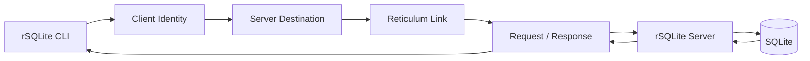
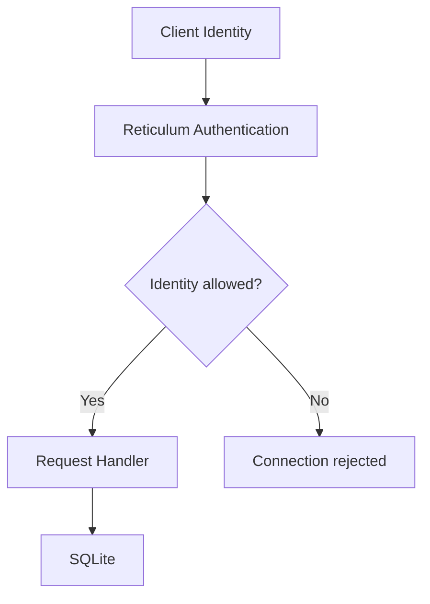

# rSQLite

**SQLite over Reticulum.**

rSQLite is a lightweight client/server application that provides access to a SQLite database over the [Reticulum Network Stack](https://reticulum.network/).

It combines the simplicity of SQLite with Reticulum's Identity, Destination, Link, and Request/Response mechanisms to provide a small database service.

> **Project status:** rSQLite is currently under active development. The current release is `0.1.0`.

---

## Why rSQLite?

SQLite is deliberately simple: a database can be a single file.

Reticulum provides a different way to connect applications: identities, destinations, links, and cryptographically authenticated communication.

rSQLite brings the two together:

```text
                Reticulum Network
                       │
                       │
             ┌─────────┴─────────┐
             │                   │
        rSQLite Client      rSQLite Server
             │                   │
        SQL requests             │
             │                   ▼
             └──────────────► SQLite
```

---

## How It Works

A typical request follows this path:



The server exposes an rSQLite Destination identified by its Reticulum Destination Hash.

The client connects to that Destination, establishes a Reticulum Link, and sends SQL through the Request/Response interface.

On the server, the SQL request is executed against the configured SQLite database and the result is returned to the client.

---

## Authentication and Access Control

rSQLite uses Reticulum Identity authentication together with an explicit server allow-list.



The server maintains an allow-list containing the Identity Hashes of authorized clients.

```text
Client Identity Hash
        │
        ▼
/etc/rsqlite/allowed_identities
        │
        ▼
rSQLite Server
```

The allow-list contains **Identity Hashes**, not Destination Hashes.

---

## Features

- SQLite database access over Reticulum
- Reticulum Identity-based authentication
- Identity allow-list
- Reticulum Link communication
- Request/Response SQL execution
- Command-line client
- Dedicated server process
- Multiple configured remote servers
- systemd integration
- Lightweight Python implementation
- Debian installation script
- Manual installation procedure

---

## Installation

### Debian

The repository includes an automated Debian installer:

```bash
sudo ./install.debian.sh
```

The installer creates the required Python environment, configuration, server identity, access-control file, and systemd service.

> **First-time setup:** A reboot is recommended after installation
> before using rSQLite for the first time.

### Manual installation

For a manual installation, see:

**[INSTALL.md](INSTALL.md)**

The manual procedure describes the filesystem layout, identities, configuration, access control, systemd service, and client setup.

---

## Quick Start

After installation, start the client:

```bash
rsqlite
```

Select a configured server and enter SQL at the:

```text
rSQL>
```

prompt.

For example:

```sql
SELECT sqlite_version();
```

or:

```sql
CREATE TABLE users (
    id INTEGER PRIMARY KEY,
    name TEXT
);
```

Then:

```sql
INSERT INTO users (name) VALUES ('Bob');
SELECT * FROM users;
```

The SQLite database is created automatically when the server receives its first SQL request.

---

## Configuration

The client and server have separate configuration files.

### Client

```text
~/.config/rsqlite/rsqlite-cli.conf
```

A client can contain one or more configured rSQLite servers:

```ini
[identity]

file = /home/USER/.reticulum/identities/rsqlite

[server.local]

name = SERVER_NAME
destination_hash = SERVER_DESTINATION_HASH
```

### Server

```text
/etc/rsqlite/rsqlite-server.conf
```

The server configuration defines:

- Reticulum Identity
- SQLite database
- authorized Identity Hash list
- announce settings

Example:

```ini
[server]

identity = /var/lib/rsqlite/.reticulum/identities/rsqlite-server
database = /var/lib/rsqlite/rsqlite.db
allowed_identities = /etc/rsqlite/allowed_identities

[announce]

enabled = no
announce_at_start = yes
```

rSQLite does not currently implement Reticulum Announce.

The `[announce]` section is reserved for future releases. The current `0.1.0` release does not use these settings.

---

## Architecture

The project is intentionally small.

```text
rSQLite
│
├── Client
│   ├── CLI
│   ├── Configuration
│   ├── Identity
│   └── Transport
│
├── Reticulum
│   ├── Identity
│   ├── Destination
│   ├── Link
│   └── Request / Response
│
└── Server
    ├── Configuration
    ├── Access Control
    ├── SQL Handler
    └── SQLite
```

At runtime, the important flow is:

```text
SQL
 │
 ▼
rSQLite CLI
 │
 ▼
Reticulum Identity
 │
 ▼
Destination
 │
 ▼
Link
 │
 ▼
Request / Response
 │
 ▼
rSQLite Server
 │
 ▼
SQLite
 │
 ▼
Response
 │
 ▼
rSQLite CLI
```

---

## Project Layout

```text
rSQLite/
├── rsqlite/
│   ├── __init__.py
│   ├── cli.py
│   ├── config.py
│   ├── constants.py
│   ├── formatter.py
│   ├── identity.py
│   ├── server.py
│   └── transport.py
│
├── examples/
│   ├── rsqlite-cli.conf.example
│   ├── rsqlite-server.conf.example
│   └── allowed_identities.example
│
├── docs/
├── tests/
│
├── INSTALL.md
├── install.debian.sh
├── pyproject.toml
└── README.md
```

---

## Reticulum

rSQLite uses the [Reticulum Network Stack](https://reticulum.network/) as its communication layer.

Reticulum provides the networking primitives used by rSQLite:

- Identity
- Destination
- cryptographic authentication
- Links
- routing
- Request/Response communication

---

## Design Principles

rSQLite follows a few simple principles:

### Keep the database simple

SQLite remains SQLite.


### Keep the network layer separate

Reticulum handles networking and cryptographic identity.

rSQLite handles the application protocol and SQL execution.

### Authenticate identities, not passwords

Access control is based on Reticulum Identity Hashes and an explicit allow-list.

### Keep the service small

The project is intentionally lightweight.

---

## Current Status

The current `0.1.0` release includes:

- working CLI client
- working server
- Reticulum transport
- Request/Response SQL execution
- SQLite integration
- Identity-based access control
- Debian installer
- systemd server integration
- manual installation documentation

The complete client → Reticulum → server → SQLite → response path has been tested on Debian.

---

## Roadmap

- [x] Client
- [x] Server
- [x] Reticulum transport
- [x] Identity authentication
- [x] Access control
- [x] SQLite execution
- [x] Debian installer
- [x] Manual installation documentation
- [ ] Test suite
- [ ] Expanded documentation
- [ ] API documentation
- [ ] Public package release
- [ ] `1.0.0`

---

## Documentation

| Document | Purpose |
|---|---|
| [README.md](README.md) | Project overview and quick start |
| [INSTALL.md](INSTALL.md) | Manual installation |
| `install.debian.sh` | Automated Debian installation |
| `examples/` | Configuration examples |
| `docs/` | Extended documentation |

---

## License

rSQLite is licensed under the [MIT License](LICENSE).

The rSQLite project itself is distributed under the MIT License. Dependencies, including Reticulum, remain subject to their respective licenses.

---

## Contributing

rSQLite is an experimental open-source project.

Issues, ideas, testing, documentation improvements, and code contributions are welcome.

Before opening a large change, please consider discussing the design in an issue so that the project can remain small and coherent.
